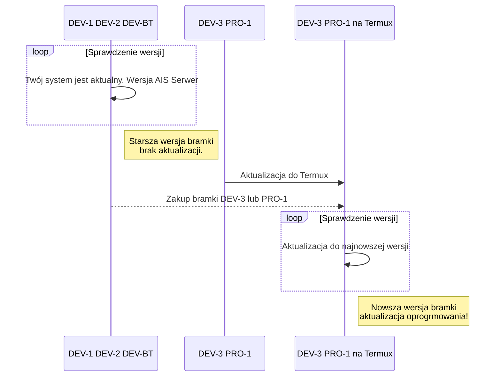

<!--truncate-->

## ABC bezproblemowej aktualizacji

:::tip Kopia 

Przed aktualizacją zalecamy wykonać [kopię zapasową konfiguracji](/docs/ais_bramka_configuration_software#kopia-zapasowa-konfiguracji).
W ten sposób sprawdzisz poprawność swojej konfiguracji przed rozpoczęciem aktualizacji i zwiększysz prawdopodobieństwo bezproblemowej aktualizacji.

:::

:::important Konsola 

W razie problemów z aktualizacją z aplikacji, uruchom [aktualizację z konsoli](/docs/ais_bramka_update_manual), w ten sposób będziesz miał na bieżąco wgląd w logi i postęp aktualizacji oraz będziesz mógł zdiagnozować przyczynę problemu.
:::

:::caution Poczekaj 

Aktualizacja i pierwsze uruchomienie po aktualizacji może trwać dłużej - poczekaj cierpliwie.
W każdej chwili możesz sprawdzić status systemu (dowiedzieć się co robi bramka) w konsoli komendą ``htop`` i/lub ``pm2 logs``
:::

## Potrzebujesz pomocy?

:::warning Reset 
Jeżeli nie jesteś w stanie zdiagnozować problemu - nie przejmuj się, jesteśmy przygotowani, żeby Ci pomóc.
Stworzyliśmy specjalnie dla Ciebie prostą procedurę, która pomoże przywrócić domyślne kody i ustawienia systemu - zapoznaj się z opisem: [Wykonanie pełnego resetu aplikacji](/docs/ais_bramka_reset_ais_step_by_step).
:::

:::important Programowanie w serwisie 
Jeżeli nie jesteś w stanie wykonać procedury pełnego resetu i Twój system nadal nie działa, to możesz wysłać nam urządzenie do zaprogramowania.
Szczegóły opisane na forum w wątku: [Programowanie w serwisie](https://ai-speaker.discourse.group/t/usluga-programowania-urzadzen-w-ai-speaker/1368)
:::

##  Nikodem

W tej wersji systemu przechodzimy na pakiety Termux. Termux to otwarty emulator terminala dla Androida, który pozwala na uruchomienie środowiska Linux na urządzeniu z Androidem. Ponadto za pomocą menedżera pakietów aplikacji można zainstalować dodatkowe oprogramowanie. Pakiety Linuxa w Termux są skompilowane z Android NDK i mają poprawki zgodności, aby działały na Androidzie.

W repozytoriach Termux znajduje się ponad 1000 pakietów. Dodatkowo możesz skompilować własne pakiety bo Termux dostarcza też różne narzędzia do budowania, w tym kompilatory dla języków takich jak C, C++, Go, Rust. Dostępne są również interpretery dla popularnych języków, takich jak NodeJS, Python, Ruby.

:::caution **Przejście na binarki Termux zalecane jest tylko na nowych bramkach DEV-3 i PRO-1**,
osoby które mają starsze bramki zachęcemy do zakupu nowszej bramki w promocji opisanej na forum: [Na problemy - PROMOCJA](https://ai-speaker.discourse.group/t/na-problemy-promocja/3122)
:::

Na poniższym diagramie zobrazowaliśmy jak uzyskać aktualizację w zależności od modelu bramki.

Jak przejść na Termux opisaliśmy krok po kroku na forum: [Przejscie na binarki Termux](https://ai-speaker.discourse.group/t/przejscie-na-binarki-termux/2977)

Co i jak można zrobić w Termux opisane jest na stronach: [Termux Wiki](https://wiki.termux.com/wiki/Getting_started)

###  Zigbee2Mqtt

Aktualizacja Zigbee2Mqtt do najnowszej wersji.
W najnowszej wersji jest obsługiwanych [ponad 2500 urządzeń od ponad 340 producentów](https://www.zigbee2mqtt.io/supported-devices/):

Szczegóły w dokumentacji Zigbee2Mqtt: https://www.zigbee2mqtt.io/

###  Asystent domowy

Najnowsza wersja Asystenta domowego, czyli naszego pakietu ``ais-dom`` bazującego na Home Assistant Core.
W najnowszej wersji [dostępne jest ponad 2480 integracji](https://www.home-assistant.io/integrations/):

Szczegóły w dokumentacji Home Assistant: https://www.home-assistant.io/integrations/

--------

##### AI-Speaker 01/2023
